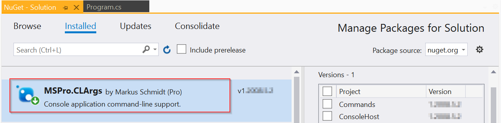

# CLArgs - A dotnet command-line parser

*CLArgs* is a **Command-Line Parser** or Command-Line Interpreter, 
which comes as a [*NuGet Package*](https://www.nuget.org/packages/MSPro.CLArgs) **for dotnet console applications**.

> `Application.exe [Verbs] [Options] [Targets]`

`CLArgs` turns your dotnet Console Application 
	into a **modern command-line application**
	with **minimal coding effort**
	while providing **maximum flexibility** and **extensibility**.

## Documentation

**Verbs** [optional] represent different actions / commands your application can execute.

**Options** are the options / parameters which an action (verb) may need to run.

**Targets** [optional] are the targets on which you want to perform an action, like a list of files. 

[Full documentation is on GitPages](https://msc4266.gitbook.io/clargs/).

## Installation

Add the latest `MSPro.CLArgs` [NuGet package](https://www.nuget.org/packages/MSPro.CLArgs) to your project and start using it - no dependencies!



## Examples

### Data Converter

```
> DataConverterApp.exe XMLtoJSON --NullValueHandling=Default File1.xml Files2.xml
```
`XMLToJSON` would be the *Verb* - the *Command* that determines what should be done. `NullValueHandling`is an option that is passed as a *Parameter* to the `XMLtoJSON`*Command*. And the two files are the *Targets* which would be passed to the *Command*. 

### Time converter

This application converts a given datetime (incl. time-zone) into UTC. The application does not support *Verbs* or *Targets*, it simply uses *Options*. [Sample Code](samples/Sample.ConvertToUtc/)

```
> ConvertToUtc.exe --LocalDateTime='2020-08-01 08:10:00' --LocalTimeZone='Pacific Standard Time'
```

#### Code

##### void Main()

```csharp
private static void Main(string[] args)
{
	// ...
	Commander.ExecuteCommand( args);
	// ...
}
```

##### The functionality -> the Command
``` csharp
//
// Implement your functionality as a Command that takes Parameters (see below)
//
[Command("ConvertToUtc")]
class ConvertToUtcCommand : CommandBase<ConvertToUtcParameters>
{
    protected override void Execute(ConvertToUtcParameters ps)
    {
        // Time Zone checking - inline: string to TimeZone
        var localTimeZone=     TimeZoneInfo.FindSystemTimeZoneById(ps.LocalTimeZone);
        Console.WriteLine($"LocalDateTime={ps.LocalDateTime} "+
                          $"in TimeZone ''{ps.LocalTimeZone}''");
        
        DateTime utc = TimeZoneInfo.ConvertTimeToUtc( 
            ps.LocalDateTime, localTimeZone);
        
        Console.WriteLine($"is UTC: {utc}");
    }
}
```
**Output**

```
LocalDateTime=01.08.2020 08:10:00 in 'TimeZonePacific Standard' Time
is UTC: 01.08.2020 15:10:00
```

##### The Options -> the Parameters
```csharp
//
// The parameters class. Command-line options will be turned into Parameters
//
class ConvertToUtcParameters
{
    [OptionDescriptor("LocalDateTime", required:true, 
             helpText:"A local date and time that should be converted into UTC.")]
    public DateTime LocalDateTime { get; set; }

    [OptionDescriptor("LocalTimeZone", required:true, 
             helpText:"Specify the LocalDateTime's time zone")]
    public string LocalTimeZone { get; set; }
}
```

> Note: There are a couple of more options how to handle the *LocalTimeZone* option. In the example above it is simply defined as string. However, you could replace it with an *Enum* to enforce certain values, or you can even provide your own converter and/or validators.

[All Samples on GitHub](samples)

# Feature List

* Simple but powerful to use
  * Probably only one single line of code in your app: `Commander.ExecuteCommand( args);`
* Zero dependencies of the NuGet package
* Any dotnet version
* Unlimited number of *Verbs*
* Plug-In concept: Automatic *Command* resolution based on *Verbs*
* Different *argument-sets* for each Command
  * Sub-Classes (inheritance) for parameter objects

See *[Command-Runner](https://github.com/msc4266/CLArgs/tree/master/CommandRunner)* for an extensible skeleton to use CLArgs.

* Flexible argument *validation and completion*
* Clean error-handling to report *all* errors instead of only the first one
  * When using a console application, 
    It can be frustrating to see "*Param1 is missing*" and 
    once you fixed it you get: "*Param2 is missing*".
  * `CLArgs` reports all errors in a single run.
* Support for command and argument help-text
  * Help-Texts and argument definitions can be loaded from files, from Resources or they can be build-in by code or a combination of these. 
  * This includes support for localized help-messages.
* Support for custom property types and *enums* in your parameter classes
* Support converting custom value converters
  * to convert any command-line string-value into any Type
* Dynamic default values (not only static, like True, "abc")
  * Including depend default values, e. g. on other values
* ...

<sub>Markus Schmidt (PRO), Munich (DE), 2020-07-10</sub>