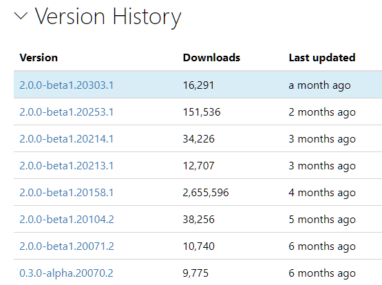

# The Competition

Is `CLArgs` just another command-line interpreter or parser?

Yes, it is another command-line arguments parser.

No, it is better than all others \(I believe\).

It is better because all others I found had major disadvantages or missing features so I could not use any of them.

> I thought it was time to reinvent the wheel!
>
> Not the \(Flint\) stone wheel, not the wooden one and not the rubber one. There are so many command-line interpreters out there. I wanted to invent the wheel with air inside, where you can chose the right pressure you need - one fits all.
>
> Let's reinvent the way how to build modern command-line apps.

### What is a Competitor

A Competitor was mentioned in a blog or as a suggestion somewhere. A Competitor does not look as it was a forgotten package in a beta state. It does not have dependencies on a specific run-time. It has a documentation and it contains examples.

## System.CommandLine - DragonFruit

Initially I was quite happy to see that there is an approach from Microsoft. Read the [MSDN Article \(March 2019\) - Parse the Command Line with System.CommandLine](https://docs.microsoft.com/archive/msdn-magazine/2019/march/net-parse-the-command-line-with-system-commandline)

Obviously there is a [NuGet package](https://www.nuget.org/packages/System.CommandLine) for it, that evolved from Alpha 0.3 to Beta 2.0.0-beta1-20303.1 \(2020-07-18\) in 18 month. I started using it and found out it supports all features I needed but the coding effort was to high and too static with regards to adding new commands or changing / adding a new option to an existing command.

You may also read about [DragonFruit](https://github.com/dotnet/command-line-api) - there are many articles on the web. But since these articles were written, not much has changed. Somehow it looked like the developers are not convinced it is good enough for a release version and they got stuck in fixing issues, to keep it alive and to have a monthly release.

## CommandLineParser

[CommandLineParser](https://www.nuget.org/packages/CommandLineParser/) was my second choice. Unfortunately, there's support for only one Verb.

