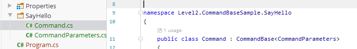

# Level 2 - Standard

[Level 1](../Level1/index.md) contained the very basics to parse a command-line and we were using only the `Arguments` class. On Level 2 I want to introduce some classes and concepts to make `CLArgs` more powerful (than its [competition](competition.md)).

`CLArgs` has several components / classes to accomplish the [Mission](misson.md). [Level 3](Level3/index.md) describes their purpose and how to use each class individually. For most people, even for me, this would be to complex, however it gives you total control and flexibility. 

## CommandBase

`CommandBase<T>` is the base class that provides all the functionality and flexibility you normally need.

* A *Verb* becomes a *Command*

* A *Command* takes *parameters*

  * Command-Line *Arguments* : string[]
  * Options : name value (values is of type string)
  * Command Parameters - a typed object specified by the Command

> There are several ways to turn a *Verb* into a *Command*. The examples of Level 1 show two of them: [Simple Verbs](../../samples/Level1/Sample1.Verbs) and the [Plugin Concept with Composition](../../samples/Level1/Sample1.Composition). 

Let's focus on Options and Command Parameters and let's implement a *SayHelloCommand* that say's <n> times "*Hello <country>*".

This is what you have to do:

```csharp
 public class Command : CommandBase<CommandParameters>
 {
     protected override void OnExecute(CommandParameters p)
     {
         for (int i = 0; i < p.Count; i++)
         {
         	Console.WriteLine($"{i]}: Hello {p.Country}");
         }
     }
 }

public class CommandParameters
{
    [OptionDescriptor("Country",  Required = true)]
    public string Country { get; set; }

    [OptionDescriptor( "Count", Required = false, Default = 1)]
    public int Count { get; set; }
}

  static void Main(string[] args)
  {
      Arguments arguments = Commander.ParseCommandLine(args);

      ICommand cmd = new SayHello.Command();
      cmd.Execute(arguments);
  }
```

Good practice would be, to organize your commands in directories, so that you can have more than just one:



There is absolutely nothing that you have to code to convert arguments or whatever. Simply implement your functionality and receive a typed parameter object as you go.

```
Command-Line: --Country=Germany --Count=3
>>> Start Main()
0: Hello Germany
1: Hello Germany
2: Hello Germany
<<< End Main()
```

See [source-code](../../samples/Level2/CommandBase/Program.cs) / [sample project](../../samples/Level2/CommandBase) / [all samples](../../samples).

## What's next

* [Dynamic Default Values](dynamicDefaultValues.md)

* [Value conversion - Option (string)  value to property value](convertValues.md)
