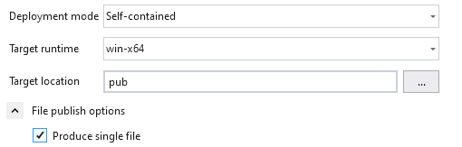
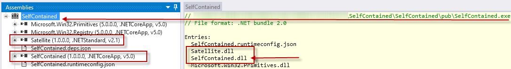

# MSPro CLArgs Version History

## 2021-12-11 - December 2021 Release

* Support for .net 6.0
* Allow empty string as argument

## 2021-09-07 - September 2021 Release

* Fixes
* Improved help output
* Support for ? and /? as a single parameter to get help
* Improved error messages
* Fixed samples
* Improved CLArgs parser

## 2021-05-04 - Mai 2021 Beta Release

* Improved support for "help" and "?" tags.

## 2021-04-26 - Mai 2021 Alpha Release 

The `CommandLineParser` was completely rewritten, to be more flexible. It now **supports blanks** to split option values from names, like `--mixed-option is-set`.  In addition, **quote handling** is now more standard.  In addition, **option tags are now string** instead of character, only, to support option tags. 

* Fixed a bug in Option Names not respecting `Setting.IgnoreCase`
* Introduced Unit Testing

### Compatibility changes

The `' ` character is no longer supported in the command-line to mark a string. Always use `" ` instead.

`DEPLOY /Package="Sprint 03" --dst-env 01-DEV /dn:"Fixed API" "  Another target"`

#### Settings.cs

```
char[] OptionsTags     --> string[] OptionsTags
char[] OptionValueTags --> string[] OptionValueTags
```


## 2021-04-12

I have started and migrated some old project, called *CleanFolders* to use `CLArgs`. This project serves as a real world example, that demonstrates how to use `CLArgs` in most cases. Check it out here [CleanSolution CLArgs application](https://github.com/msc4266/CleanSolution).

While migrating this project, I recognized some limitations, which I have fixed immediately:

* ***Targets* can now be used in a `CommandContext`.**
  
  Previously, *Targets* were available in `CommandLineArguments`, only. This made it very inconvenient to use *Targets* with `Commander.ExecuteCommand`:
  Now you can specify a property in your CommandContext that will receive the targets specified in the command-line.
  
  ```csharp
  class CommandContext
  {
  	[Targets]
      public List<string> Directories { get; set; } = new();
      ...
  }
  ```
    (See again the *CleanSolution* example for using *Targets*)
  
* **BETA Support** for `OptionTagValue` '  ' to **allow blanks as option-value separator**, like `/p "Parameter value" /x 5` instead of `/p:"Parameter value" /x:5`.
  Basically, this works; BETA because I haven't extensively tested all scenarios.
  
* Improved `Settings` to **support help-text output for different consoles width'**: `HelpAlignColumn` and `HelpFullWidth` properties.

* Provides files ('@' token) are now found in the current (working) directory and then in the application's (exe) directory. This is extremely useful when you want to create **Profiles**.

### Self-Contained Assemblies

* NO support for automatic *Command* resolution (`AssemblyCommandResolver`) with **self-contained** Assemblies, yet.



  > Self-Contained .net Assemblies are special, in a way, that there is an EXE, only. However, this EXE that you see in a directory is <u>not</u> an Assembly - it is a PE File! 
  >
  > This PE-File contains all Assemblies of your solution. Once you run such PE-Exe-File, `Assembly.GetEntryAssembly()`returns the entry Assembly, which is a DLL with the name of the EXE. So far, so good, for all commands in the entry Assembly.
  >
  > To resolve Commands in other Assemblies, normally `Directory.GetFiles( ppDomain.CurrentDomain.BaseDirectory( pattern)` does the job. For self-contained applications, this call won't return and more Assembly, as all other Assemblies have become part of the EXE.
  >
  > I haven't found any way yet, to Load Assemblies when they are 'baked-into' a self-contained executable.



To work around this, you can provide your own Assembly resolver instead of `AssemblyCommandResolver`, to find all your command implementations:

```csharp
Commander.ExecuteCommand(args, new Settings
{
	CommandResolver = new AssemblyCommandResolver(assemblyFileNames),
    ...
```

> Don't forget to tell me, once you have written such resolver for PE-Files!

### Command-Line Profiles

A **Profile** is a **collection of predefined command-line arguments**. You can store such profiles as *global* profiles in the Application (EXE) directory or you can override these global profiles by providing a *local* profiles in the current working directory.

If you store your application together with its global profiles, for example, here
`%LocalAppdata%\MSPro\Programs` (don't forget to set a path to it), you can run `CleanSolution.Exe @sln.profile`  from any working directory and apply the settings from the global profile stored with the application.

## 2021-04-09

Released to make some updates available to the public. `CLArgs`is mainly used in my personal project on a daily basis. This project and the daily use of it, gives new ideas, servers as the best proof of concept you can have and it helps me to find and fix issues.

### Changes since last version in January

* Fixed bug with @ file handling
* Introduced *AllowMultiple* functionality
  (see [CleanSolution CLArgs application](https://github.com/msc4266/CleanSolution/blob/main/src/CleanSolution.Command/CommandContext.cs) to see how it is used)
* Refactored to use .net5.0 and C# 9.0
* Support for .net 5.0
* Help output pretty much improved
  * Support for '|' character in help-text to enforce line-breaks.
    (see [CleanSolution CLArgs application](https://github.com/msc4266/CleanSolution/blob/main/src/CleanSolution.Command/CommandContext.cs) to see how it is used)

